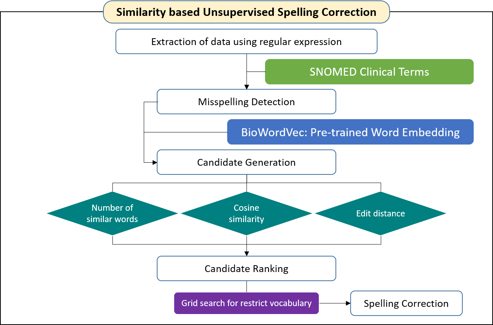

# Similarity-based-Unsupervised-Spelling-Correction-Using-BioWordVec

This is similarity-based unsupervised spelling correction using [BioWordVec] for bacteria culture and antimicrobial susceptibility reports.  
Please visit the original repo of [BioWordVec] (Yijia Zhang, et al.) for more information about the pre-trained BioWordVec.  

## Environments
	python 3
	numpy 1.18
  	pandas 1.1
	keras 2.4.3
	gensim 3.8.3
	pyxDamerauLevenshtein 1.6.1
	symspellpy 6.5
	
## Pretrained Embedding
* BioWordVec  
https://ftp.ncbi.nlm.nih.gov/pub/lu/Suppl/BioSentVec/BioWordVec_PubMed_MIMICIII_d200.vec.bin

## Usage

Example:  

	python SUSC_run.py --data sample.csv

Arguments:  

	--data				Data 
	--similar_n			Most similar words 
	--fasttext_min_similarity	Cosine similarity 
	--edit_distance_threshold	Edit distance 

## Overall Architecture

## Citation
If you find this work useful for your research, please cite our paper:

	Kim T, Han S, Kang M, Lee S, Kim J, Joo H, Sohn J
	Similarity-Based Unsupervised Spelling Correction Using BioWordVec: Development and Usability Study of Bacterial Culture and Antimicrobial Susceptibility Reports
	JMIR Med Inform 2021;9(2):e25530
	URL: https://medinform.jmir.org/2021/2/e25530
	DOI: 10.2196/25530
	
[BioWordVec]: https://github.com/ncbi-nlp/BioWordVec
